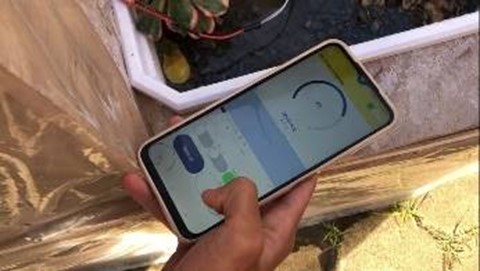
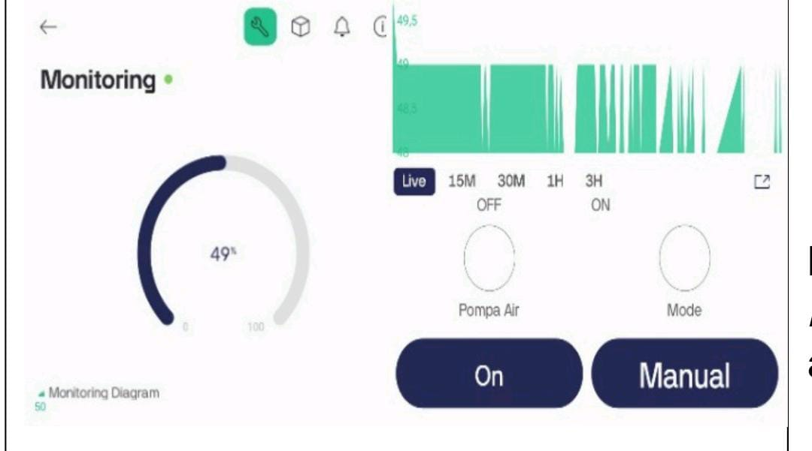

# Portable Pulse Oximetry System using MAX30102 and Solar Charging
The automatic system uses ESP32 for watering plants, then the watering data is channeled to a cellphone using the Blink platform (Wifi), and the energy source uses renewable energy, namely mini solar panels.

## 🔌 Wiring Diagram

Below is the wiring diagram for the device:

### App Interface Preview

Below are the screenshots of the mobile application:

 

## 🙏 Catatan Penggunaan | Usage Notice

📌 **Note:**  
Proyek ini dibuat dengan tujuan edukasi dan pengembangan perangkat monitoring kesehatan.  
**Mohon untuk tidak melakukan plagiarisme atau menyalin tanpa pemahaman.**  
Jika ingin mengadaptasi, menggunakan, atau mengembangkan proyek ini, **harap mencantumkan nama pembuat: _Afriana Wardiman_**.

Silakan pelajari, modifikasi, dan kembangkan lebih lanjut dengan bijak.

📩 Jika ada pertanyaan terkait alat ini, kamu dapat menghubungi:  
**afrianawardiman19@gmail.com**

---

📌 **Note:**  
This project was created for educational and development purposes in the field of health monitoring systems.  
**Please do not plagiarize or copy without understanding.**  
If you wish to reuse, adapt, or expand upon this project, **please give proper credit to the creator: _Afriana Wardiman_**.

Feel free to study, modify, and develop it further in a responsible manner.

📩 For any questions regarding this device, you may contact:  
**afrianawardiman19@gmail.com**

---

## 📝 License

This project is open-source and available under the MIT License.

