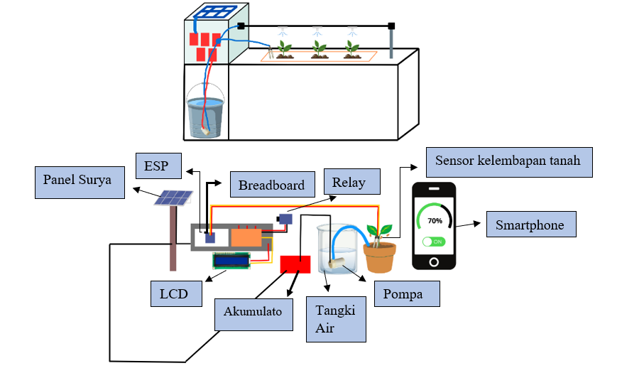

# Portable Pulse Oximetry System using MAX30102 and Solar Charging

This project is a **portable pulse oximeter device** based on the **MAX30102 sensor**. It is capable of measuring **blood oxygen saturation (SpO₂)** and transmitting data via **Bluetooth** to a mobile application for real-time monitoring.

## 🔧 Features

- Measurement of blood oxygen saturation (SpO₂)
- Real-time data transmission via Bluetooth
- Compatible with mobile application (Android)
- Portable, compact design
- **Solar-powered lithium battery** charging system

## ⚙️ Hardware Components

- ESP32 Wemos D1 Mini
- MAX30102 Pulse Oximeter Sensor
- Lithium Polymer (Li-Po) Battery
- Solar Panel (for recharging the battery)
- Voltage regulation and protection circuit

## ☀️ Power System

The device uses a **Li-Po battery** as its main power source. To support long-term outdoor usage and reduce dependency on manual charging, a **solar panel is integrated** to continuously recharge the battery under sunlight.

This allows the device to be used in rural or off-grid environments, enhancing its portability and sustainability.

## 🔌 Wiring Diagram

Below is the wiring diagram for the device:

## 🧠 Software

The core code is written in **Arduino (C++)**, utilizing libraries for:

- `MAX30105.h` – Sensor communication
- `spo2_algorithm.h` – SpO₂ calculation algorithm
- `BluetoothSerial.h` – Bluetooth communication
- `PPGProcessing.h` – Signal filtering and processing

## 📱 Application Integration

The device transmits SpO₂ and PPG data to a mobile application via **Bluetooth Classic**, allowing for real-time display, recording, and warning notifications.

### App Interface Preview

Below are the screenshots of the mobile application:

## 📦 File Overview

- `code.ino` – Main Arduino sketch containing the device logic and Bluetooth communication

## 📌 Future Improvements

- Integration with cloud for remote health monitoring
- Enclosure design for outdoor protection
- Expandable features (heart rate, temperature, etc.)

---

## 🙏 Catatan Penggunaan | Usage Notice

📌 **Note:**  
Proyek ini dibuat dengan tujuan edukasi dan pengembangan perangkat monitoring kesehatan.  
**Mohon untuk tidak melakukan plagiarisme atau menyalin tanpa pemahaman.**  
Jika ingin mengadaptasi, menggunakan, atau mengembangkan proyek ini, **harap mencantumkan nama pembuat: _Afriana Wardiman_**.

Silakan pelajari, modifikasi, dan kembangkan lebih lanjut dengan bijak.

📩 Jika ada pertanyaan terkait alat ini, kamu dapat menghubungi:  
**afrianawardiman19@gmail.com**

---

📌 **Note:**  
This project was created for educational and development purposes in the field of health monitoring systems.  
**Please do not plagiarize or copy without understanding.**  
If you wish to reuse, adapt, or expand upon this project, **please give proper credit to the creator: _Afriana Wardiman_**.

Feel free to study, modify, and develop it further in a responsible manner.

📩 For any questions regarding this device, you may contact:  
**afrianawardiman19@gmail.com**

---

## 📝 License

This project is open-source and available under the MIT License.
